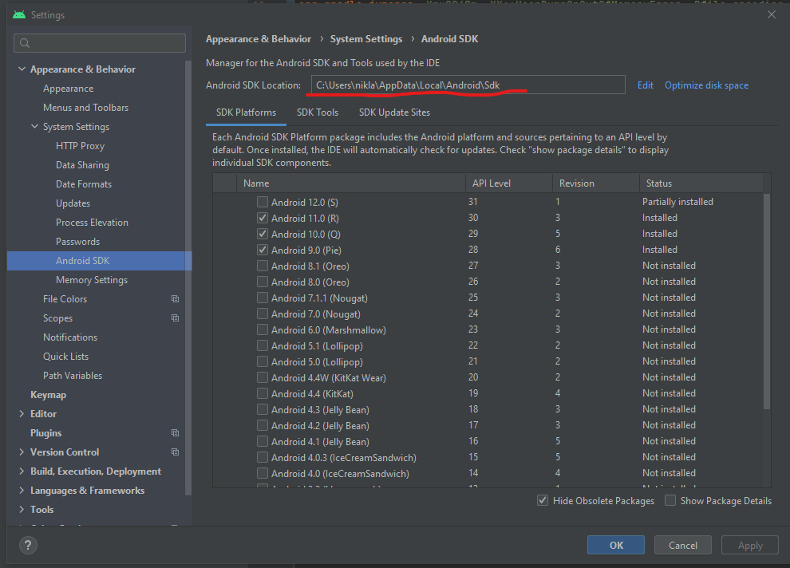

# Do Good Get Good #
## A time reporting app from Technogarden ##

## Building the project ##
The app is a cross platform application built in react native. Development focus on using as many built in components and existing libraries as possible. The instructions assumes you have some knowledge how operating systems works with environment variables and such.
### How to run ###
1. The source code is located in `./src`
2. You will need NodeJS from https://nodejs.org
3. After installing Node you need to install expo. `npm install -g expo`
4. You need Android Studio from https://developer.android.com/studio/
5. For **Windows** you need to add two environment variables 
   1. You need to add `ANDROID_HOME` with the value for Android SDK Location. You find it in Android Studio Settings, `Appearance & Behavior -> System SEttings -> Android SDK`
   
   1. You also need to add `JAVA_HOME` with the value for Android studio JRE, default is `C:\Program Files\Android\Android Studio\jre`
6. For **MacOS** and **Linux** you need to add two environment variables
   1. First is `ANDROID_SDK` that is the same as `ANDROID_HOME` under **Windows**
   2. Second one is to Update `PATH` with Android Studio SDK Platform tools. Usually found in `/Users/<username>/Library/Android/sdk/platform-tools`
7. After that go to the source code in a command line tool like powershell or bash and do `npm install`.
8. If you are running MacOS you need to go to the `ios` folder and runt `pod install`
9. You might need to install firestore manually with `npm add @react-native-firebase/firestore`
10. standing in the root for the source code run `expo start`, or `npx react-native run-android` or `npx react-native run-ios`

#### Trouble shooting ####
* Skapa en 'local.properties' fil i roten av Android mappen och skriv
`sdk.dir = /Users/<name>/Library/Android/sdk`
* **Android** trouble, try
```
cd android
./gradlew build
cd ..
npx react-native run-android
```


## Authors ##
- Mattias Ahlström (_Mobile application developer_)
- Alona Kirichenko (_Mobile application developer_)
- Kristoffer Johnsson (_Software tester_)
- Rebecka Eldén (_User eXperience_)

### Mentors ###
- Niklas Asp (_Developers and Testers_)
- Hannah Sundqvist (_UX_)

### Product Owner ###
- Carina Grip (_Office Manager Technogarden Göteborg_)